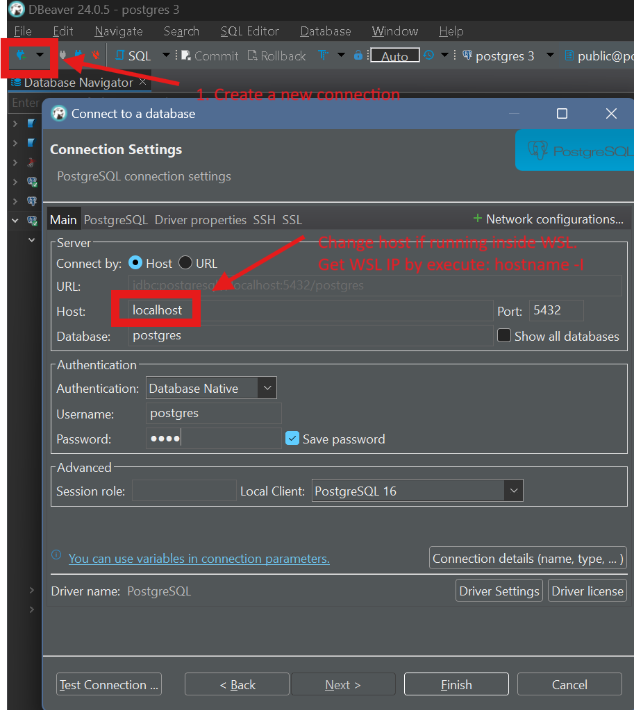

# CMS

A content management system (CMS) application to manipulate the internal database.

Powerred by [Directus.io](https://docs.directus.io/).


## Getting started

- Populate environement variables.

```bash
cp .env.example .env
```

- Run contained application with docker.

```bash
docker compose up -d
```

## Usages

### Access Dashboard

- Access CMS dashboard via exposed URL `http://localhost:8055`

- Login with configured account.

```yaml
email: (env) ADMIN_EMAIL
password: (env) ADMIN_PASSWORD
```

### Introspect Database

- Install [DBeaver](https://dbeaver.io/).

- Create new connection with the target database.



## CLI Tool

### Boostrap

- The `boostrap.ts` script is a CLI tool designed to Init app with config has defined.
- Run the CLI script with the desired command:
  ```bash
  pnpm run-bootstrap
  ```

### Export Schema

- The `exportSchema.ts` script is a CLI tool designed to export schema to json file. When create or update collections, please run script:
  ```bash
  pnpm export-schema
  ```

### Import Schema

- The `importSchema.ts` script is a CLI tool designed to import schema.
- Run the CLI script with the desired command:
  ```bash
  pnpm import-schema
  ```

### Export Data

- The `exportData.ts` script is a CLI tool designed to export data to sql file.
- Run the CLI script with the desired command:
  ```bash
  pnpm export-data
  ```

### Import Data

- The `importData.ts` script is a CLI tool designed to import data.
- Run the CLI script with the desired command:
  ```bash
  pnpm import-data
  ```
